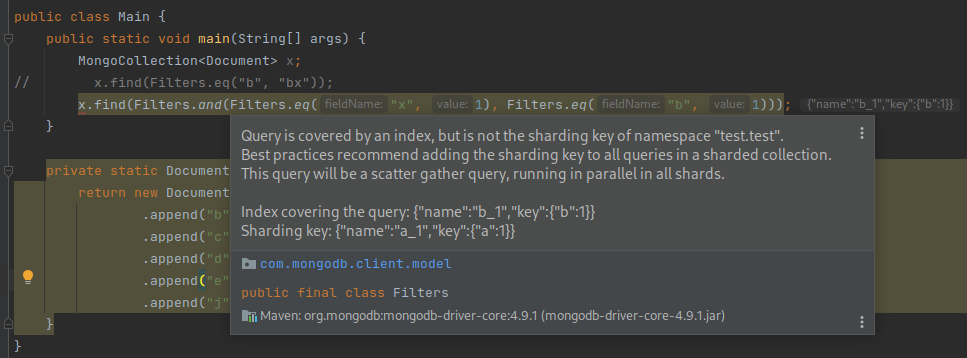

# mongodb plugin for intellij poc

:warning::fire: This is not a production-ready plugin and not supported by MongoDB in any means. :fire::warning:

This plugin provides basic intelli-sense for MongoDB. It connects to a MongoDB cluster, detects basic patterns in your
code and adds suggestions and warnings for wrong index usage.

## How to play with it

1. Open this project with IntelliJ IDEA and run the following command in your terminal:

```./gradlew runIde```

It will pop up an IntelliJ Community version. Create a new Java project with Maven or Gradle and add MongoDB driver
dependency.

2. Create in the root of the new project a .mongodb file and add the URL of a cluster.

If you are starting a new cluster in your local machine, you can just write:

```mongodb://localhost```

## Features

* [x] Connects to a MongoDB cluster
* [x] Detect current indexes in a MongoDB cluster
* [x] Detects sharding status of a database
* [x] Understands basic composition with `Filters` builder and `new Document`.

## Screenshot

