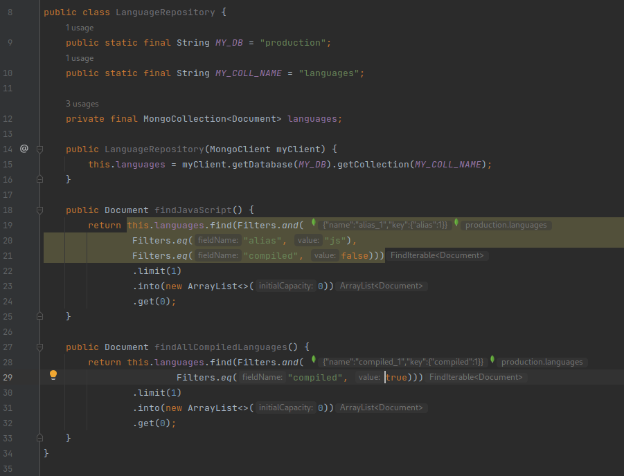
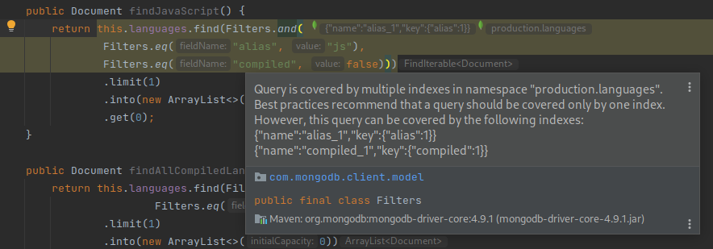
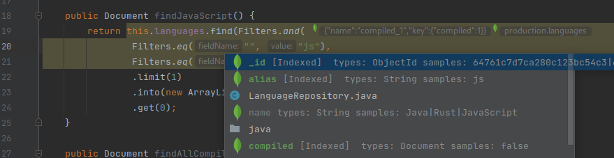
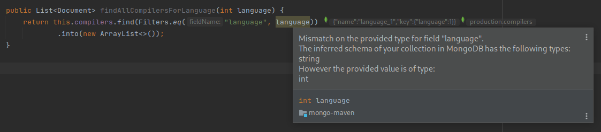

# mongodb plugin for intellij poc

:warning::fire: This is not a production-ready plugin and not supported by MongoDB in any means. :fire::warning:

This plugin provides basic intelli-sense for MongoDB. It connects to a MongoDB cluster, detects basic patterns in your
code and adds suggestions and warnings for wrong index usage.

## How to play with it

1. Open this project with IntelliJ IDEA and run the following command in your terminal:

```./gradlew runIde```

It will pop up an IntelliJ Community version. Create a new Java project with Maven or Gradle and add MongoDB driver
dependency.

2. Create a new MongoDB connection in the databases view.

:warning: Now it assumes that all queries run in the namespace `test.test` :warning:

## Features

* [x] Connects to a MongoDB cluster for intellisense.
* [x] Detect current indexes in the connected MongoDB cluster.
* [x] Detects sharding status of a database.
* [x] Understands basic composition with `Filters` builder and `new Document`.
* [x] Code analysis to detect which collections are used.

### Code Smell Detection

* [x] Dynamic field names with high cardinality.
* [x] Queries not using indexes.
* [x] Queries that can cover multiple indexes.
* [x] Type checking against the inferred schema of the collection.

## Screenshots

### Example Code With Hints


### Example Warning For Multiple Colliding Indexes


### Example AutoComplete from Schema


### Example Type Checking from Schema
